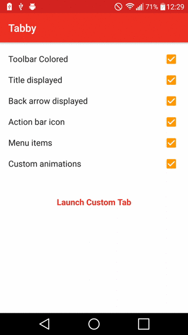

#Tabby
 
=====

    

Tabby (Cat), is a simple sample application demoing the features of the new Chrome Custom Tabs support library for Android. Using this application you can demo:

- Coloring the toolbar
- Displaying the title
- Customising the close icon
- Adding an action bar icon
- Adding menu items
- Using custom animations

The application uses Helper Classes from the [example project by Google](https://github.com/GoogleChrome/custom-tabs-client).
 
 

    

Requirements
------------

 - [Android SDK](http://developer.android.com/sdk/index.html).
 - Android [5.1 (API 22) ](http://developer.android.com/tools/revisions/platforms.html#5.1).
 - Android SDK Tools
 - Android SDK Build tools 23.0.0.0
 - Android Support Repository
 - Android Support library

Building
--------

To build and install a debug version, run this from the root of the project:

    ./gradlew installDebug

Attributions
------------

Thanks to the following for use of images off of Noun Project:

[Theresa Berens](https://thenounproject.com/theresaberens) - Cat Icon
